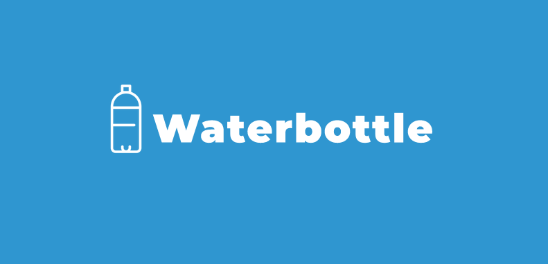

<p align = "center"></p>


<h1 align = "center">Waterbottle - A simple migration tool</h1>
<div align = "center">

[](https://github.com/yosa12978/Waterbottle/issues)
[](https://github.com/yosa12978/Waterbottle/network)
[](https://github.com/yosa12978/Waterbottle/stargazers)
[](https://github.com/yosa12978/Waterbottle)


</div>

## Table of Contents
- [Table of Contents](#table-of-contents)
- [Getting Started](#getting-started)
  - [Installation](#installation)
  - [Usage](#usage)
    - [Migration files](#migration-files)
    - [Commands](#commands)
- [Built With](#built-with)
- [Authors](#authors)
- [License](#license)
- [Contributing](#contributing)
- [Donate](#donate)

## Getting Started

---

### Installation

Build application
```go build -o waterbottle.exe cmd/waterbottle/main.go```

Add this application to PATH and create WATERBOTTLE_PATH environment variable with path to executable file

eg ```D:\Apps\Waterbottle\```

### Usage


#### Migration files

You should create 2 files one UP and one DOWN event
example:
```
initial_0001_UP.sql
initial_0001_DOWN.sql
```

UP file consist of either CREATE TABLE or ALTER TABLE queries
DOWN file consist of rollback UP queries

EXAMPLE

initial_0001_UP.sql
```
CREATE TABLE test (
    ID int,
    FirstName varchar(255),
    LastName varchar(255)
);
```
initial_0001_DOWN.sql
```
DROP TABLE test;
```

#### Commands

1. migrate
2. name - eg Initial-0001
3. UP/DOWN migration
4. Database URL Address

Example migrate command: ```waterbottle migrate initial_0001 UP username:password@tcp(127.0.0.1:3306)/testdb```

1. help

## Built With

* [Go](https://golang.org) - Programming Language


## Authors

* **[Yusuf Yakubov](https://github.com/yosa12978)** - *Whole work*


## License

This project is licensed under the MIT License - see the [LICENSE](LICENSE) file for details

## Contributing

1. Fork it
2. Create your feature branch ```git checkout -b feature/foo```
3. Commit your changes ```git commit -m 'New feature'```
4. Push to the branch ```git push origin feature/foo```
5. Create a new Pull Request

## Donate

* **Bitcoin**: 36jW1LyMEicXFLrQLnFnswqc1hxBEkrhwJ
* **Ethereum**: 0xaD7c500FD3947E85d64CbF6A5d1D31372ed0601A
* **Webmoney (WMZ)**: Z280011393319
* **Webmoney (WMR)**: R923631667215